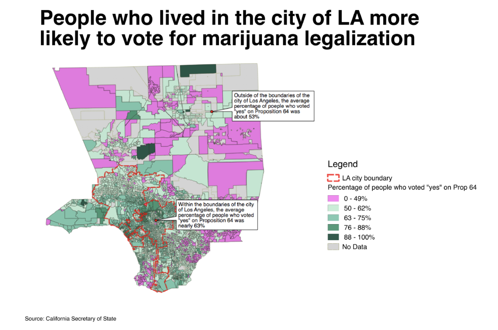
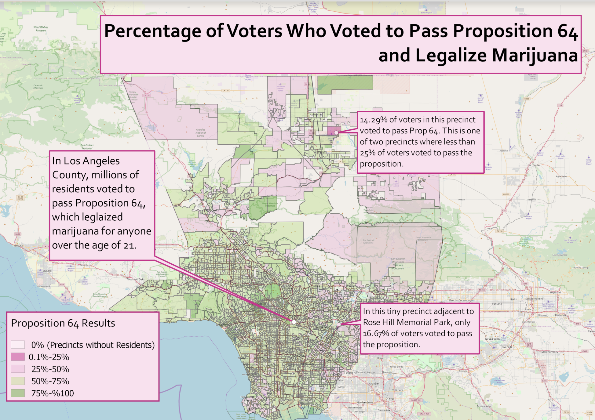
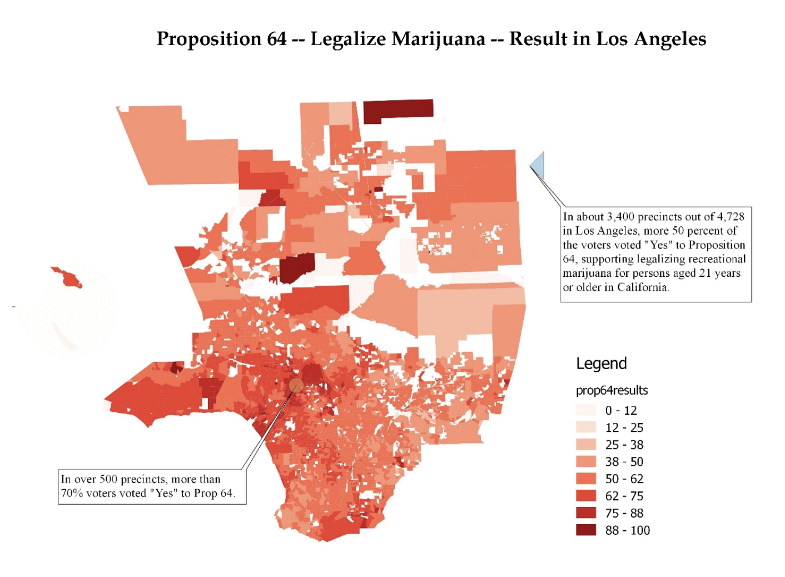
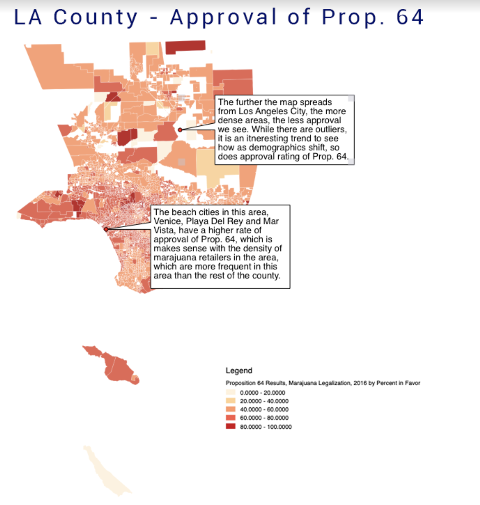
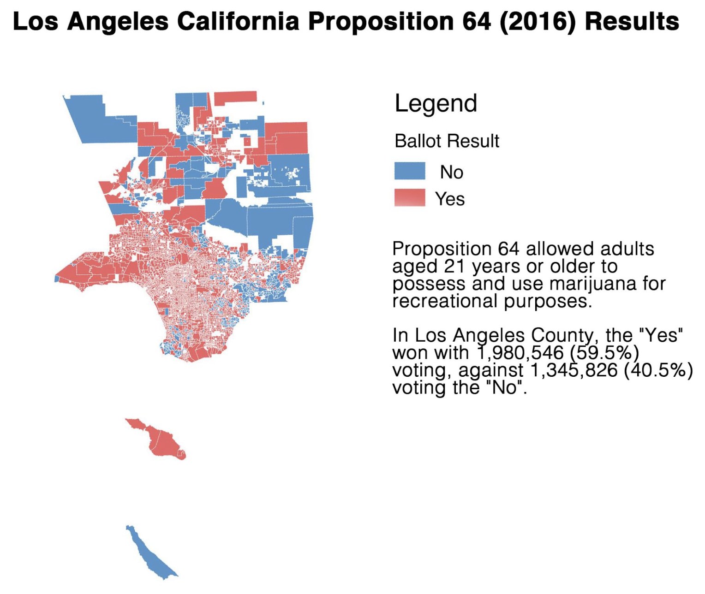
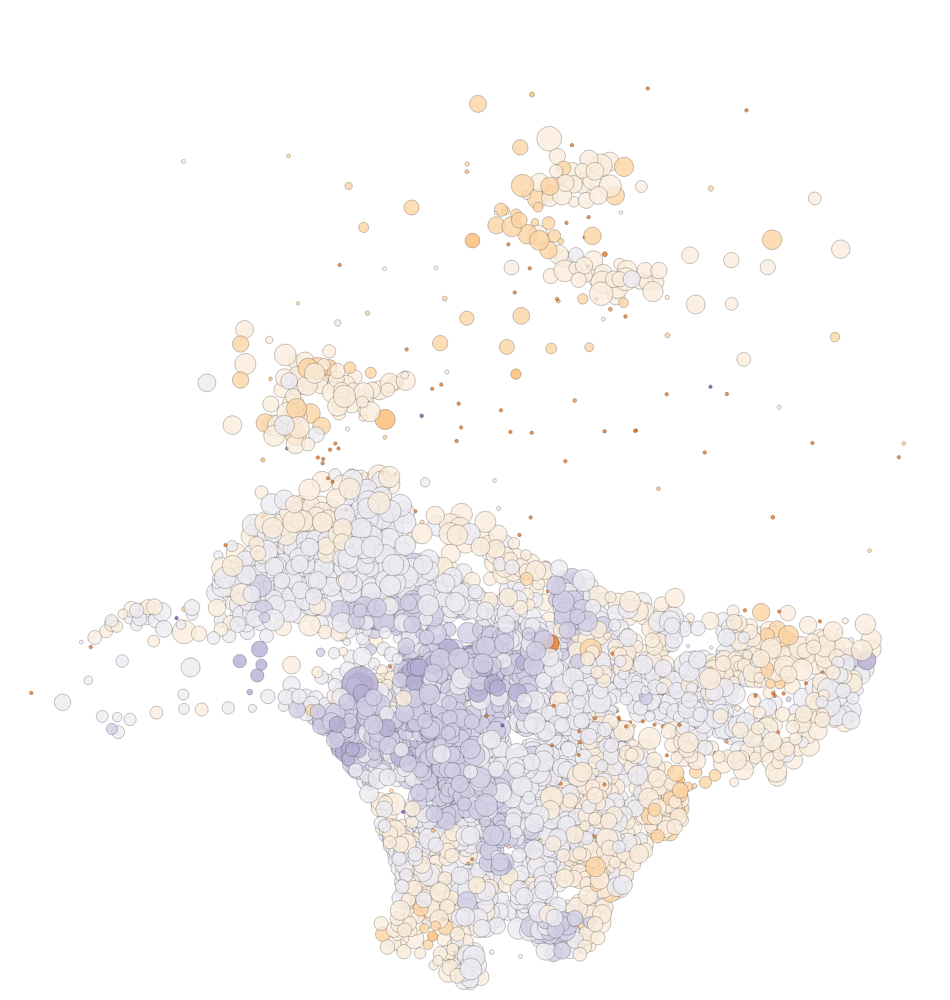

<h1 class="ml7">
  
    
Data&nbsp;&nbsp;Journalism&nbsp;&nbsp;&nbsp;USC&nbsp;&nbsp;2019

  
</h1>

# Week 8
This week, we'll explore the wild world of geocoding.

---

### HW revue

You all put your own twist on this week's homework:

---

### Lecture

[Slides](https://docs.google.com/presentation/d/1qOnjRVqIvLJFLkA6Rs6fnn0HAJX3s7fY6wB9pVeiEIM/edit?usp=sharing)

---

### Hands-on

**1. Get some data**

Let's grab data on shootings involving L.A. County Sheriff's deputies [here](https://data.lacounty.gov/Criminal/All-Shooting-Incidents-for-Deputy-Involved-Shootin/d5zc-33fr).

Let's open and explore in Excel. You'll notice that this does have lat/lon. That'll come in handy when we want to see how accurate our geocodes are.

**2. Learn about geocoding in QGIS**

There are a couple options [for how to do that](http://duspviz.mit.edu/tutorials/geocoding/).

**3. Check out how the free version of a paid service works**

Point your browser [here](https://www.geocod.io/)

**4. Open file up in QGIS**

and

**5. Also open up the original file in QGIS**

Do they match?

**6. Let's do some reporting**

And figure out how many of these shootings happen in different cities in L.A. County. [Start here](https://hub.arcgis.com/datasets/7b0998f4e2ea42bda0068afc8eeaf904_19?geometry=-125.811%2C32.178%2C-110.793%2C35.374).

---

### Links

Geocoding services

* [US Census](https://geocoding.geo.census.gov/): Free! But not the most accurate option. US addresses only.
* [Google Maps API](https://developers.google.com/maps/documentation/geocoding/start): Very accurate (but not perfect). 2,500 free geocodes per day. Pay beyond that. API Key required
* [Geocodio](https://www.geocod.io/): API or upload. Fast, relatively cheap, accurate.

Article from lecture

* [Digital maps' unsung hero: how the geocoder puts us on the grid](https://www.theguardian.com/technology/2014/jan/13/google-maps-geocoder)

---

### Homework

[**Fill out the Mid-Semester Survey**](https://goo.gl/forms/9oXNoWqCruyBkdTD3). Please complete by Wednesday at 5 PM.

Install some stuff, create some accounts.

* R: [Go here](https://cran.cnr.berkeley.edu/) to install R
* Github: [Go here](https://github.com/) to create a Github account. Or, if you already have one, log in to amke sure you know the username and password.
* Miniconda: [Go here](https://conda.io/miniconda.html) to download and install. Download the `python 2.7` version.
* Story memo: 50-100 words about Final Project progress over last week